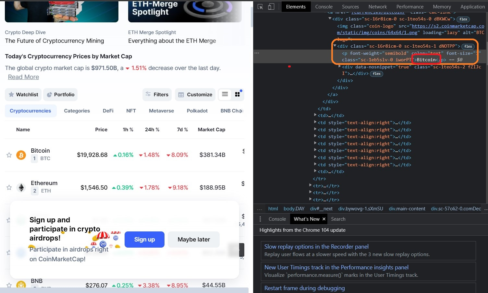
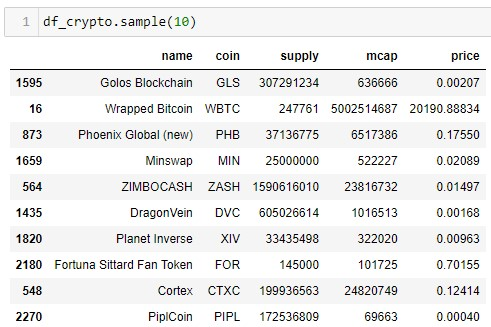
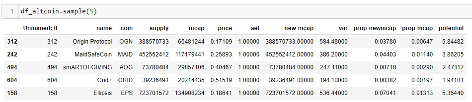
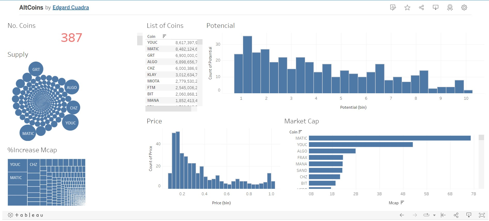
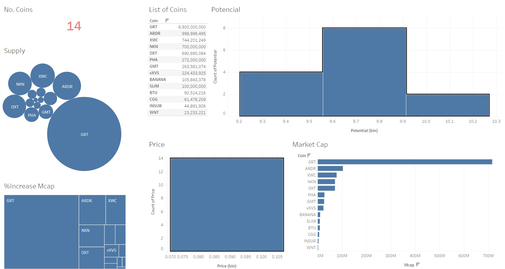
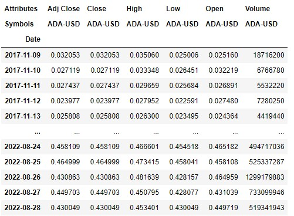
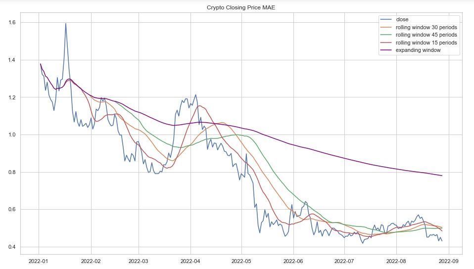
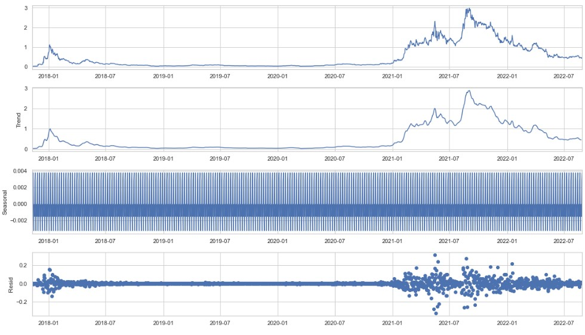
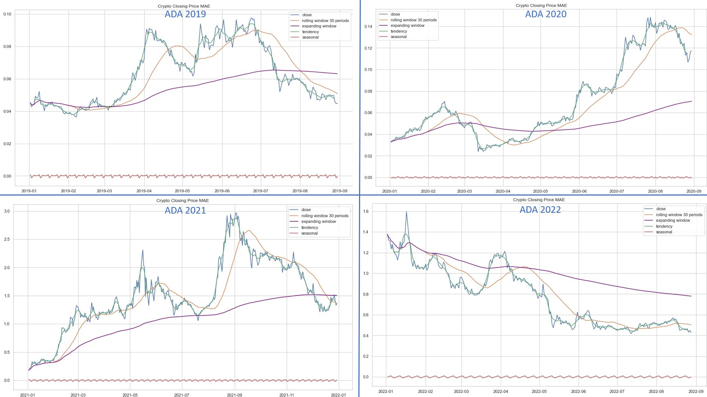
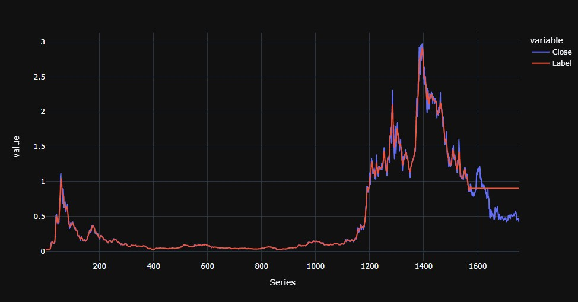

#

# Project_IV-Final_Project

##  Time series exploration 📈 Crypto Price
### By: Edgard Cuadra
### Date: September 1st 2022

#

#
## Hypothesis:
#

Using Data Analitics can we find potential altcoins that have the condition or potential to generate significant returns by their unique characteristics. can we create a predictive model that can generate a moderate prediction for future investments?

#

### Get Started with Web Scrapping:
 

For the project ill be extracting the list of all crypto currencies list from the we page listed in the URL = "https://coinmarketcap.com/"
 

We need web page number of page to be added in the url by using the parameter for the url "/?page=3" since the web page only displays 100 coins per page.
 

By using Selenium we can create a bot that will scroll thought the dynamic page (meaning it loads information while you scroll the page, otherwise it wont give you all the pages information) in order to do this we need to make a loop so that we can perform the same task in all the web pages that have information of value. we will only do this for the first 30 pages out of 97. this is because we are only interested in coins that have a market capital (meaning that a significant investment of money is already in capital of said coin).

 

Code for web scrapping and scrolling selenium:

    current_scroll_position, new_height= 0, 1
    while current_scroll_position <= new_height:
    current_scroll_position += 8
    driver.execute_script("window.scrollTo(0, {});".format(current_scroll_position))
    new_height = driver.execute_script("return document.body.scrollHeight")

    html = driver.execute_script("return document.body.outerHTML;")

Example of what the bot does:
 

 

Following the extraction of the html with selenium, we need to determine what we want to extract, in this case we can start by gettin the coins name, ticker, market capital, supply and current price. we do this by ispecting the html of the web page and finding the tag of the desired information once we have this we can use Beautiful soup (BS4) to jsonify the html and be able to locate the text and save it into a list  
 

Example of browser html inspect for info:
 

 

Once the information has been extracted and cleaned the text to only have the desired information we temporarly store each colum in a list. meaning that we will have to convert them into a data frame using command for zip list, followed by pandas.dataframe to create a table as following:
 

 

As a result we now have a list of 3000 coins, but how do we determin which ones are the ones we are most interested in and will be using for our analisis?
 

In order to do this we will need to calculate some field to further filter the coins that are of no use to us. 
 

To get started we need to get familiar with some concepts: 

    Market Capital = Money invested in one coin
    Global Market Capital = Amount of money in all crypto
    Circulating supply = Amount of existing coin
    Price = Market Capital / Circulating Supply
 

Knowing this we can use the mathematical rule of three to find out how mucha market capital needs to move in order to get a coin to a specific value. in our particular case we want marginal prices that can spike to the amount of $1. so we create set colum to value $1 and create a column with the new market capital.
 

now that we have a new market capital, it would be best to create a column with the variation of price between the inicial market capital and the new market capital. as a compliment we can add two columns that will tell us the proportion of the new and old market capital represents of the global market capital.
 

Given this information we can start filtering our 3000 coins and narrowing it down to a more sizable sample to explore and predict.
 

We want coins who's:
 

    Price < $1
    Market Capital > $10,000,000.00
    Propotion to Global Market Capital <= 1%
    Variation between new and old market cap <= 1000
 

Dataframe once we hace created the calculated field and filters:

After we applied this filters we get as a result a list of 387 coins, we can now use wisualization tools to examin any particular tendency and behaviour that can be of our interest so that we can futher filter this list to 10 to 20 coins in which we can invest.
 

#
## Visualization:
#

To analize visualy eventhough we can use python, i decided to make a csv file so that i could be imported in Tablau and have a more dynamic analysis. for the couins i want a display of the porportion of the market capital, circulating supply, count of coins, list of those coins, current coin market price, proportion of market capital increase and a calculated field of potential projected increase of value. 
 

The analisis can be seen at the followin URL
 

https://public.tableau.com/app/profile/edgard.cuadra/viz/AltCoins_16617715752970/Alt_coinDash?publish=yes

The filter we want to apply are those coins that have the posibility of 5 folding our initial investment if they happen to reach the value of $1.00 and we also want coins whose price is under a threshold of $0.15 per current value. 

Visualization before further filter:
 

 

Vizualization after filter:
 

 

Now we have found the optimal currencies that we can invest in, now lets see if we can use a predictive model with the time series.  
 

#
## Predictive Model and Sesonality:
#

The information we extracted with the webscrappe only gives us general characteristics of the coin so we need to find a way to get the time series of said coins.
 

Using a Yahoo Finances API we can extract the time series of a specific coin and analize its behaviour over it life cicle an try to undestand.
 

First we do a query of one coin, in this case ADA - cardano in currency convetion to USD so that we can analize in a standard convertion. out of this query we get the Adjuested Closing price, the Closing price, High and Low price of the day, the price in which it Open and the Volume of currency that moved that day. the Developer (Free Version) access to the API only allows us to extract daily time series and not hourly so we are limited to the type of analysis that we can conduct. it would be optimal to have a minute movement of the tickers value over time. 
 

Sample of the data we extracted:

First lets use the closing price of the coin to evaluate its behaiviour over time, inorder to understand the behaviour of this graph we will include:

    Moving averagae envelope (MAE) for periods 15
    Moving averagae envelope (MAE) for periods 30
    Moving averagae envelope (MAE) for periods 45
    Tendency line
    Sesonality
    Residuals
    Expanding window

expanding window 

Bellow we can see one of the alternate coins that has a moving average and tendancy for 1 year for 2022 as an example. the expanding window give uses a compounded average of the data as the time series progreses giving us a compounded average which show a general tendency. in this case the tendency is the behaviour of a rolling average of period one. 
 

    If the Closing value > than Rolling window the market is **Bullish** 

    If the Closing value < than Rolling window the market is **Bearish**

This graph shows us how the market is behaving but wont give us much information of how the market will behave in the future. its better to have a general understanding on how its behaving that blindly try to just invest in a coin. 
 

Overall the general trend is a decline over time showing that the market is bearish and has flattende out.its always recomended to read the latest news of a currency to understand why there has been such negative tendencies to avoid making a decision that might be seen as risky.
 

For a better undestanding of the behaviour we can decompose the time series to see if there are any clear tendencies, sesonality or residuals that might give us a general behaviour of how the time series is behaving and to see if there is a distinct pattern that we can use to make predictions:
 

Decomposition:

 

We apply the sesonality to our yearly graphs to see how they are represented in the general yearly graphs. as it can bee seen in the following graph there seems to be no gerenral seonality or behaviour that marks a yearly tendency. this indicates that the market is volatile and unpredictable since there is no repetitive pattern. 
 

 

Lets see how this affects a predictive model since the seasonality is negligible and is seems that the residuals are low except for the year 2021 where there was alot of residuals according tho the decomposition. 
 

Using the Pycaret machine learning model we set it up so that it uses a time series to make a predictive model. this library allows us to iterate over several predictive models and we select the best one in accordance to our least error mesure of our choice (MAE, MSE, RMSE, R2)
 

 

as seen in our comparative models we have a very peculiar R2 being negative which indicates that our model isnt very precise. we are selecting our model in accordance to which ever has the lowest Moving Average Envelope (MAE) in this case being the K Neighbor Regressor. 
 

Once we run our best model and graph it we have the following result:
 

 

#
## Conclusion and Recomendations:
#

The predictive model for time series has no independent variables that afect the dependant so it needs tendency, sesonality and residuals to make an acurate prediction since the seasonality is negligible and is seems that the residuals are low the output of the model is the global average and it outpust a straight line.

this makes sences since its imposible to make a prediction on a volatile market since its son unpredictable, otherwise it would be easy to get rich just by learning predictive models. 

in this our hypothesis is disproven and we can use the data to understand past behaviours in conjunction with news related to the crypto alternate coin but we can not predict future behaviour using past behaviours since there is no clear tendency.

